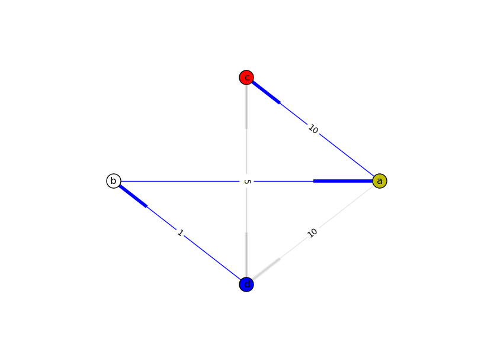
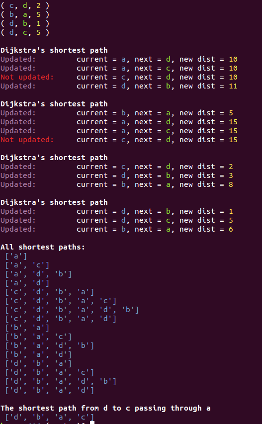

# Algorithms - Papadimitriou

## Chapter 4 - Exercise 14

> You are given a strongly connected directed graph G = (V, E) with positive edge weights along with a particular node v0 ∈ V. Give an efficient algorithm for finding shortest paths between all pairs of nodes, with the one restriction that these paths must all pass through v0.


O algoritmo foi escolhido por apresentar um problema de melhor caminho. Ele pode ser aplicado em diversos contextos. Um exemplo seria em uma empresa de logística que quer o melhor caminho para entregar um produto passando por um ponto de abastecimento (v0).


### Solução naive

Uma solução ingênua do algoritmo poderia ser feita da seguinte maneira.

1. Testamos todos os caminhos possíveis entre todos os pares de nós, guardando seus respectivos custos
2. Retiramos todos os caminhos que não passam por v0
3. Para cada par de nós (u, v), procuramos todos os caminhos que começam com u e terminam com v
4. Guardamos os caminhos com os menores custos

O tempo de execução desse algoritmo é de O(2<sup>|V|</sup>).


### Solução eficiente

A solução eficiente consiste em usar um algoritmo de menor caminho, nesse caso Dijkstra é um bom candidato.

1. Para todos os vértices, rodamos o algoritmo de Dijkstra. Ele irá retornar o menor caminho do vértice em questão até os outros vértices
2. Para cada par de nós (u, v), somamos o menor caminho de u até v0 com o menor caminho de v0 até v, esses caminhos formam a solução do problema

O tempo de execução desse algoritmo é de O(|V|<sup>2</sup>).

### Código da solução

```py
def main:
    # Lemos a matriz de adjacencia que gera o grafo
    [vertices, edges] = read_csv('graph.csv')

    g = create_graph(vertices, edges)

    # Computamos todos os melhores caminhos
    shortest_paths = compute_all_shortest_paths(g, vertices)

    # Imprimimos todos os melhores caminhos passando por v0
    all_paths(shortest_paths, v0)
```

```py
def compute_all_shortest_paths(g, vertices):
    shortest_paths = {}

    # Para cada vertice no grafo
    for a in vertices:
        shortest_paths[a] = {}

        # Rodamos o Dijkstra
        dijkstra(g, g.get_vertex(a))

        # Para todos os outros vertices
        for b in vertices:
            destination = g.get_vertex(b)
            path = [destination.get_id()]

            # Pegamos o melhor caminho de a ate b
            shortest(destination, path)

            # Guardamos esse caminho em um dicionario
            shortest_paths[a][b] = path

        # Limpamos as variaveis dessa rodada do Dijkstra
        g.reset()

    return shortest_paths
```

```py
def all_paths(shortest_paths, v0):
    # Para todo par de vertices
    for frm in shortest_paths:
        for to in shortest_paths[frm]:
            # Pegamos o caminho passando por v0
            path = get_path_with_v0(shortest_paths, v0, frm, to)
            print_path(path)
```

```py
def get_path_with_v0(shortest_paths, v0, frm, to):
    path = []

    # O caminho total eh a juncao do caminho do vertice origem ate v0
    # junto com o caminho de v0 ate o vertice destino.

    # Neste caso, pegamos primeiro de v0 ate o destino e depois
    # da origem ate v0, pois o caminho eh recuperado de tras para frente
    path.extend(shortest_paths[v0][to])
    path.extend(shortest_paths[frm][v0][1:])

    # Invertemos o caminho, ja que ele eh gerado de tras para frente
    return path[::-1]
```

### Rodando a solução

O código recebe como entrada três parâmetros: v0, um nó de origem e um nó de destino. Os valores padrões são "a", "d" e "c", respectivamente.

O nó de origem e de destino são usados apenas para exibir uma representação gráfica do grafo e o melhor caminho entre os dós nós passando por v0.

Além disso, o script mostra todas as etapas do cálculo de distância do Dijkstra e todos os melhores caminhos.

Você pode chamar o script da seguinte forma:

```sh
python passing.py <v0> <from> <to>
```

O grafo é representado no arquivo "graph.csv" na forma de uma matriz de incidência.

Dependências do script:
- Python 2.7
- networkx
- matplotlib




