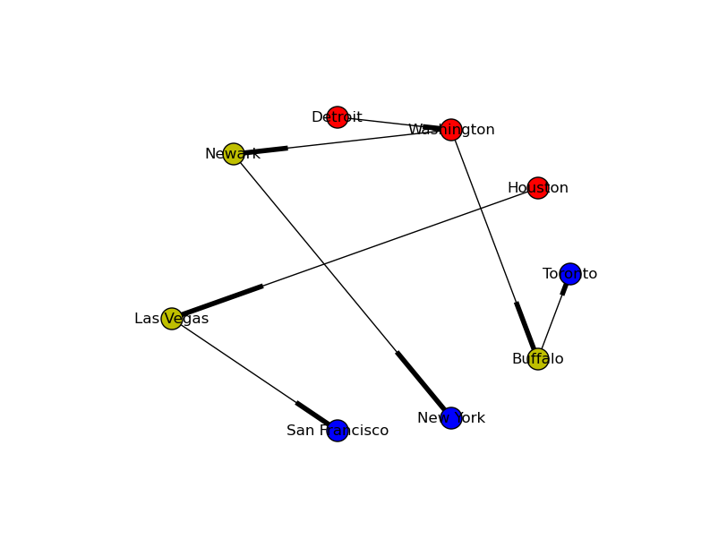

# Algorithms Design - Eva Tardos


## Chapter 7 - 14

We define the Escape Problem as follows. We are given a directed graph G = (V , E) (picture a network of roads). A certain collection of nodes X E V are designated as populated nodes, and a certain other collection S E V are designated as safe nodes. (Assume that X and S are disjoint.) In case of an emergency, we want evacuation routes from the populated nodes to the safe nodes. A set of evacuation routes is defined as a set of paths in G so that (i) each node in X is the tail of one path, (ii) the last node on each path lies in S, and (iii) the paths do not share any edges. Such a set of paths gives a way for the occupants of the populated nodes to “escape” to S, without overly congesting any edge in G.

(a) Given G, X, and S, show how to decide in polynomial time whether such a set of evacuation routes exists.


### Solução naive

Uma solução força bruta consiste em:

1. Para todo vértice em X, computar todos os caminhos para todos os vértices em S
2. Para cada conjunto de caminhos, verificar se nenhum deles compartilham arestas
3. Caso haja algum caminho, retorna

O tempo dessa solução é O(2<sup>|E|</sup>), já que consistem em computar todas a combinações possíveis.

### Solução eficiente

A solução eficiente encontra consiste em usar o algoritmo de Ford-Fulkerson para resolver problemas de Network Flow.

1. Adicionamos um novo vértice chamado "SOURCE" ao grafo
2. Adicionamos arestas que ligam "SOURCE" a todos os vértices em X
3. Adicionamos um novo vértico chamado "SINK" ao grafo
4. Adicionamos arestas que ligam todos os vértices em S a "SINK"
5. Atribuimos a cada aresta uma capacidade de fluxo de valor um
6. Usamos o algoritmo de Ford-Fulkerson
7. Retiramos os vértices "SOURCE" e "SINK" e suas respectivas arestas

O algoritmo roda em tempo O(|E|f), sendo "f" o valor do fluxo máximo encontrado pelo algoritmo de Ford-Fulkerson.

### Código da solução

```py
def main():
    # Lemos o grafo de um arquivo
    [x_cities, s_cities, v_cities, edges] = read_csv('cities.txt')

    # Criamos o grafo com os vertices "SOURCE" e "SINK"
    # essa funcao seria definida a seguir
    graph = create_graph(x_cities, s_cities, v_cities, edges)

    # Chamamos o algoritmo de Ford-Fulkerson para o grafo
    flow_value, flow_dict = nx.maximum_flow(graph, 'SOURCE', 'SINK',
                                            flow_func=ford_fulkerson)

    # Pegamos apenas as arestas que foram que foram usadas pelo algoritmo
    edges_path = get_path(flow_dict)

    # Exibimos o grafo com o resultado
    show_graph(flow_dict, x_cities, s_cities, v_cities, edges_path)
```

```py
# Essa funcao ira criar um grafo com as cidades como vertices e as estradas
# como arestas. Esse grafo tera um diferencial, que sao os vertices
# "SOURCE" e "SINK". Precisamos criar esses vertices artificiais para podermos
# usar o algoritmo de Ford-Fulkerson.
def create_graph(x_cities, s_cities, v_cities, edges):
    graph = nx.DiGraph()

    # Concatenamos todas as cidades em um unico array
    all_cities = get_all_cities(x_cities, s_cities, v_cities)

    # Adicionamos todas as cidades e arestas
    for vertex in all_cities:
        graph.add_node(vertex)
    for edge in edges:
        graph.add_edge(edge['from'], edge['to'], capacity=1)

    # Adicionamos um no como fonte para que possamos usar o algoritmo de Ford-Fulkerson
    graph.add_node('SOURCE')
    # Ligamos esse no a todos os vertices de cidades populadas (grupo X)
    for vertex in x_cities:
        graph.add_edge('SOURCE', vertex, capacity=1)

    # Adicionamos um no como sumidouro para que possamos usar o algoritmo de Ford-Fulkerson
    graph.add_node('SINK')
    # Ligamos esse no a todos os vertices de cidades seguras (grupo S)
    for vertex in s_cities:
        graph.add_edge(vertex, 'SINK', capacity=1)

    return graph
```


```py
# Pega as arestas que foram usadas como caminho pelo Ford-Fulkerson
def get_path(flow_dict):
    edefault = []

    for city in flow_dict:
        for destination in flow_dict[city]:
            # Ignoramos as que tem relacao com os nos fonte e sumidouro
            # Pegamos aquelas que possuem valor diferente de zero, ou seja,
            # que sua capacidade esta sendo usada
            if (flow_dict[city][destination] != 0 and
               city != 'SOURCE' and destination != 'SINK'):
                edefault.append((city, destination))

    return edefault
```

### Rodando a solução

O código exibe um grafo com a solução de caminhos para o grafo expresso no
arquivo "cities.txt". Este arquivo segue o seguinte formato:

```
"X:Houston","V:Las Vegas"
"V:Buffalo","S:Toronto"
```

Onde cada linha representa uma aresta, e cada cidade é prefixada com o grupo
a qual pertence:

- X: para cidades com populações em risco
- S: para cidades seguras
- V: outras cidades

Para rodar o script basta digitar no terminal:

```sh
python routes.py
```

Dependências do script:
- Python 2.7
- networkx
- matplotlib


